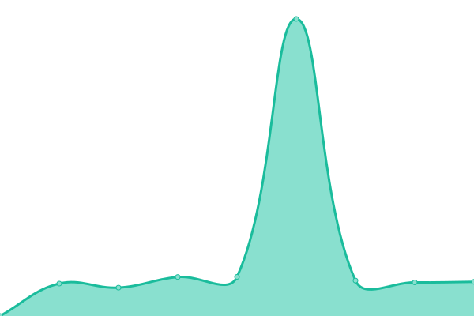

# [📈 Live Status](https://upptime.github.io/upptime): <!--live status--> **🟩 All systems operational**

This repository contains the open-source uptime monitor and status page for [Upptime](https://upptime.js.org), powered by [Upptime](https://github.com/upptime/upptime).

With [Upptime](https://upptime.js.org), you can get your own unlimited and free uptime monitor and status page, powered entirely by a GitHub repository. We use [Issues](https://github.com/upptime/upptime/issues) as incident reports, [Actions](https://github.com/bluelightcard/upptime/actions) as uptime monitors, and [Pages](https://upptime.github.io/upptime) for the status page.

<!--start: status pages-->
<!-- This summary is generated by Upptime (https://github.com/upptime/upptime) -->
<!-- Do not edit this manually, your changes will be overwritten -->
<!-- prettier-ignore -->
| URL | Status | History | Response Time | Uptime |
| --- | ------ | ------- | ------------- | ------ |
|  [Verify](https://verify.blcshine.io/brand/BLC_UK/services) | 🟩 Up | [verify.yml](https://github.com/bluelightcard/upptime/commits/HEAD/history/verify.yml) | 

 1493ms
     
 | 

<a href="https://status.blcshine.io/history/verify">100.00%</a>
    

|  [BLC UK Homepage](https://bluelightcard.co.uk) | 🟩 Up | [blc-uk-homepage.yml](https://github.com/bluelightcard/upptime/commits/HEAD/history/blc-uk-homepage.yml) | 

 898ms
     
 | 

<a href="https://status.blcshine.io/history/blc-uk-homepage">100.00%</a>
    

|  [BLC Australia Homepage](https://bluelightcard.com.au) | 🟩 Up | [blc-australia-homepage.yml](https://github.com/bluelightcard/upptime/commits/HEAD/history/blc-australia-homepage.yml) | 

 1180ms
     
 | 

<a href="https://status.blcshine.io/history/blc-australia-homepage">100.00%</a>
    

|  [DDS UK Homepage](https://www.defencediscountservice.co.uk/) | 🟩 Up | [dds-uk-homepage.yml](https://github.com/bluelightcard/upptime/commits/HEAD/history/dds-uk-homepage.yml) | 

 506ms
     
 | 

<a href="https://status.blcshine.io/history/dds-uk-homepage">100.00%</a>
    

<!--end: status pages-->

[**Visit our status website →**](https://upptime.github.io/upptime)

## 📄 License

- Powered by: [Upptime](https://github.com/upptime/upptime)
- Code: [MIT](./LICENSE) © [Upptime](https://upptime.js.org)
- Data in the `./history` directory: [Open Database License](https://opendatacommons.org/licenses/odbl/1-0/)
